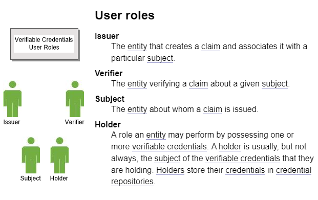
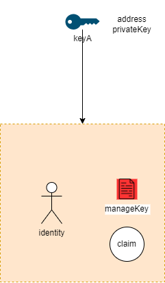
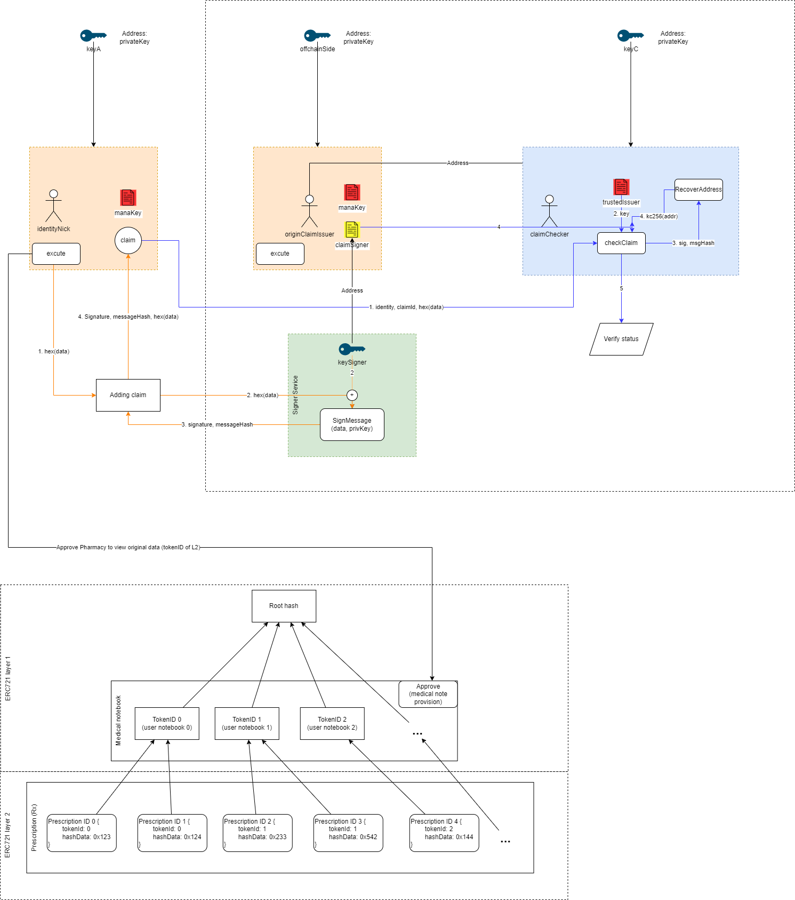

# Introduction

Decentralized Identity (DID) smart contract base on Verifiable Credential.

---

## What is a Verifiable Credential?

W3C define [W3C Verifiable Credential](https://www.w3.org/TR/vc-data-model/).

> In the physical world, a credential might consist of:
>
> - Information related to identifying the subject of the credential (for example, a photo, name, or identification number)
> - Information related to the issuing authority (for example, a city government, national agency, or certification body)
> - Information related to the type of credential this is (for example, a Dutch passport, an American driving license, or a health insurance card)
> - Information related to specific attributes or properties being asserted by the issuing authority about the subject (for example, nationality, the classes of - vehicle entitled to drive, or date of birth)
> - Evidence related to how the credential was derived
> - Information related to constraints on the credential (for example, expiration date, or terms of use).
> - A verifiable credential can represent all of the same information that a physical credential represents. The addition of technologies, such as digital signatures, makes verifiable credentials more tamper-evident and more trustworthy than their physical counterparts.
>
> Holders of verifiable credentials can generate verifiable presentations and then share these verifiable presentations with verifiers to prove they possess verifiable credentials with certain characteristics.
>
> Both verifiable credentials and verifiable presentations can be transmitted rapidly, making them more convenient than their physical counterparts when trying to establish trust at a distance.
>
> While this specification attempts to improve the ease of expressing digital credentials, it also attempts to balance this goal with a number of privacy-preserving goals. The persistence of digital information, and the ease with which disparate sources of digital data can be collected and correlated, comprise a privacy concern that the use of verifiable and easily machine-readable credentials threatens to make worse. This document outlines and attempts to address a number of these issues in Section 7. Privacy Considerations. Examples of how to use this data model using privacy-enhancing technologies, such as zero-knowledge proofs, are also provided throughout this document.
>
> The word "verifiable" in the terms verifiable credential and verifiable presentation refers to the characteristic of a credential or presentation as being able to be verified by a verifier, as defined in this document. Verifiability of a credential does not imply that the truth of claims encoded therein can be evaluated; however, the issuer can include values in the evidence property to help the verifier apply their business logic to determine whether the claims have sufficient veracity for their needs.

We define each object in our system is a Verifiable Credential or DID.


---

## What is ERC 725?

ERC 725 is a proposed standard for blockchain-based identity authored by Fabian Vogelsteller, creator of ERC 20 and Web3.js. ERC 725 describes proxy smart contracts that can be controlled by multiple keys and other smart contracts. ERC 735 is an associated standard to add and remove claims to an ERC 725 identity smart contract. These identity smart contracts can describe humans, groups, objects, and machines. ERC 725 lives on the Ethereum blockchain. [[ref](https://docs.ethhub.io/built-on-ethereum/identity/ERC725/)]

---

## ERC 735 Motivation

_"This standardised claim holder interface will allow Dapps and smart contracts to check the claims about a claim holder. Trust is here transfered to the issuers of claims."_ [[ref](https://github.com/ethereum/EIPs/issues/735)]

---

## DID

Base on W3C define and ERC725 standard



---

## Workflow simulation



---

## Pre-defined value

Pre-defined value

---

### DID type - PreDefinedClaimKeys

Base on project requirement, the `claimKey` is very dynamic, we defined here only 2 `claimKeys` for base authenticator in blockchain. We follow the idea that `claimKey` is a `string`, and `key` in `claimKey` mean `key`:`value`. If you want to use other `claimKey`, just use whatever string you want.

- [!badge variant="primary" text="PATIENT"] - [!badge variant="primary" text="PATIENT"] : Patient DID
- [!badge variant="primary" text="PROVIDER"] - [!badge variant="primary" text="PROVIDER"]: Provider (Clinic/Hospital) DID

```ts
enum PreDefinedClaimKeys {
  PATIENT = "PATIENT",
  PROVIDER = "PROVIDER",
}
```

---

### Key Purpose

Base on [ERC734](https://github.com/ethereum/EIPs/issues/734) and [ERC725](https://github.com/ethereum/EIPs/issues/725), we defined 3 key purpose

- [!badge variant="primary" text="1"] - [!badge variant="primary" text="MANAGEMENT"]: Management key. Full permissions to all function of DID.
- [!badge variant="primary" text="2"] - [!badge variant="primary" text="DELEGATE_KEY"]: Delegate key. Use to call `execute` function of DID.
- [!badge variant="primary" text="3"] - [!badge variant="primary" text=" CLAIM_SIGNER"]: Claim signer key. Use to sign a signature for claim. We will use `privateKey` of this key to sign signature

```ts
enum KeyPurposes {
  MANAGEMENT = 1,
  DELEGATE_KEY = 2,
  CLAIM_SIGNER = 3,
}
```

---

### Schemes

Base on [ERC734](https://github.com/ethereum/EIPs/issues/734) and [ERC725](https://github.com/ethereum/EIPs/issues/725), we define 4 schemes for sign data and contract call

- [!badge variant="primary" text="ECDSA"]: ECDSA scheme. We will use this scheme for signed signature, all needed function will use this scheme.

```ts
enum Schemes {
  ECDSA = 1,
}
```
