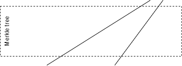

# Locking structure

This section describes the locking structure by merkle tree and how it works.

---

## Merkle tree

Before we start, let's review the concept of merkle tree.

Merkle tree is a data structure that allows you to verify the integrity of a large set of data. It is a binary tree that contains a hash value of each data. The hash value of the parent node is the hash value of the child node. The hash value of the root node is the hash value of the entire data set.

> **Wikipedia** [[ref](https://en.wikipedia.org/wiki/Merkle_tree)]  
> In cryptography and computer science, a hash tree or Merkle tree is a tree in which every "leaf" (node) is labelled with the cryptographic hash of a data block, and every node that is not a leaf (called a branch, inner node, or inode) is labelled with the cryptographic hash of the labels of its child nodes. A hash tree allows efficient and secure verification of the contents of a large data structure. A hash tree is a generalization of a hash list and a hash chain.

> Demonstrating that a leaf node is a part of a given binary hash tree requires computing a number of hashes proportional to the logarithm of the number of leaf nodes in the tree. Conversely, in a hash list, the number is proportional to the number of leaf nodes itself. A Merkle tree is therefore an efficient example of a cryptographic commitment scheme, in which the root of the tree is seen as a commitment and leaf nodes may be revealed and proven to be part of the original commitment

## Our locking structure

!!! Primary Note
Please check this [slide](https://docs.google.com/presentation/d/1nhwMKBfn4teSlBzFysbuutz5ZrBIiifI/edit?usp=sharing&ouid=100833370354507851325&rtpof=true&sd=true) for feedback about locking structture
!!!

In our locking structure, we use merkle tree to verify the integrity of the data. The data is the hash value of the data set. The hash value of the root node is the hash value of the entire data set. The hash value of the parent node is the hash value of the child node. The hash value of the leaf node is the hash value of the data set.

The locking structure of all levels is as follows:

In general structure we can see that this tree is not binary, but in fact, it is a binary tree. We implemented the merkle tree in the connector.

## How it works

In the connector, we have a merkle tree like this:

### Problem and solution

In above example, we have a happy case with number of node = 4 is a power of 2.

Because we don't know when data stop import to the tree so in many case, we can have odd number of node, then we need to add an empty node with `value =  0x0000...000`

The reason is that the number of data sets is not a power of 2, so we need to add some empty nodes to make it a binary tree. The empty nodes are marked with a red cross. Let see an example when we have 3 nodes of value at bottom.

**In above example, we have only 3 nodes of value, so we need to add 1 empty nodes to make it a binary tree. The number of nodes is the power of 2 now, we solved the problem**

Above example is just in the bottom level, so if higher level of tree has odd number of node (mean the number of node in bottom level is not the power of 2, eg: 6, 12,...) We can use the same mechanism to add empty nodes to make it a binary tree.

**In above example, we have 6 nodes of value, we can add 2 more nodes to bottom level, but that will cost a lot when the data increase like 1025 nodes or 4097 nodes, so the idea is we add where we need, that will be simpler and less cost. Then the problem is solved**

## Implemented in our structure

In this section, I will explain more detail about our locking structure at each level.

### Level 1 - DDR

At this level, we have: `tokenId`, `ddrHashedData`, `ddrRawId`, `patientDIDAddress`, `consentedProvider`, (List of Provider which DDR consented to), so we need to hash them together.
About `consentedProvider`, it's a list and can be add in future, so we count it as a standalone hash

### Level 2 - Patient

At this level, we need things to specify a patient: `tokenId`, `patientDIDAddress`, `rootPatientDDRHash`, `hashedOfAllClaim`, so we need to hash them together to get the `rootPatientHash` of this level.

About the `rootPatientDDRHash`, it is the rootHash of the merkle tree of DDR at level 1, so we need to get it from the merkle tree of DDR at level 1. Please remember that all this DDR is belong to this Patient.

### Level 2 - Provider

At this level, we don't have DDR any more, so we need to hash things: tokenId, `providerDIDAddress`, `hashedOfAllClaim` to get the `rootProviderHash` of this level.

### Level 3 - POC Study

At this level, we can compute `rootAllPatientHash` is combine of all `rootPatientHash` and finally we can get final `rootPOCStudyHash` is the top hash of all tree.

