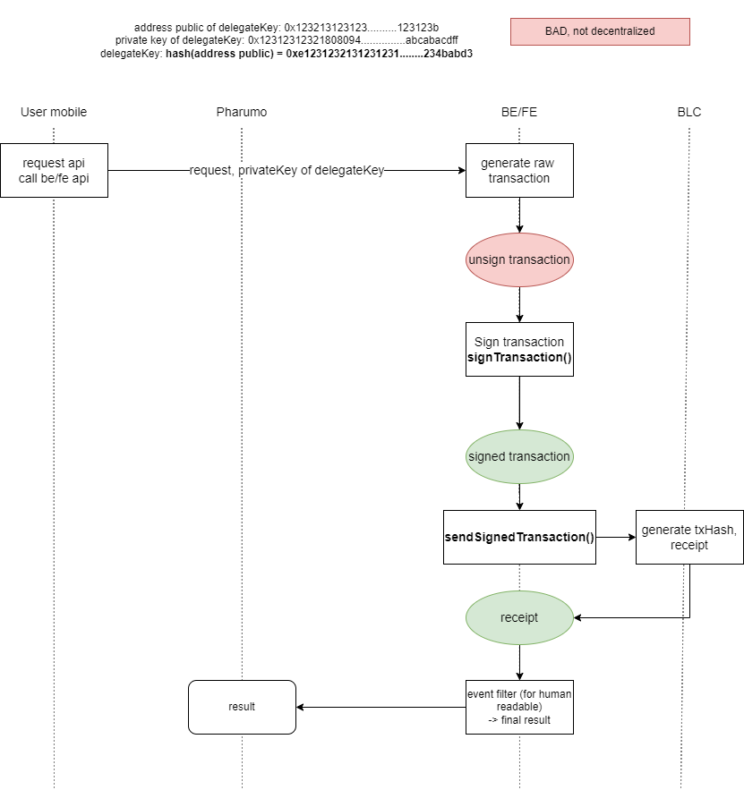
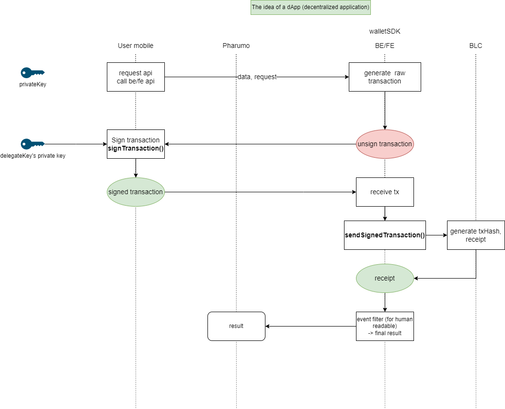

# Transaction Flow

This section transaction flow and example of how to sign transaction totaly offline

---

## Old flow

!!! Danger
This flow is deprecated, and not secure. Please use new flow
!!!

In old flow, we have 1 step to sign transaction, but we have to send private key to server to sign transaction. This is not secure, because private key is sensitive data. So we have to sign transaction totaly offline.

This image show how transaction in V1 work:



## New flow

In new flow, we do not send private key to server. Client can control their data/transaction and sign transaction totaly offline. Server only broadcast transaction to blockchain.

We have 3 step to sign and send transaction:

1. We generate raw transaction in server side and send to client
2. Client sign raw transaction and send back to server through an BE API
3. Server receive transaction broadcast transaction to blockchain

This image show how transaction in V2 work:



## Example of transaction flow (Typescript)

In this example, we use `ethereumjs-tx` with `Typescript`, install it with:

```bash
npm i @ethereumjs/tx
```

!!! Warning Warning
This is an example in `Typescript`, if you use other language, please use a suitable library in your language
!!!

!!! Primary Required custom chain
This example require a custom chain variable, in our network, we use `polygon-edge` chain. If you use other chain, please change it to your chain. You can find more information about custom chain [here](https://github.com/ethereumjs/ethereumjs-tx/blob/master/examples/custom-chain-tx.ts).

`chainId` and `name` is required and correct, `name` is a string, `chainId` is a number

```typescript
const customCommon = Common.forCustomChain(
  "mainnet",
  {
    name: "polygon-edge",
    chainId: 100,
  },
  "petersburg"
);
```

!!!

This example show how to sign transaction totaly offline
:::

```typescript
import { Transaction } from "ethereumjs-tx";
import Common from "ethereumjs-common";

// Private key of account 0x2DB04a470E7058D8b0F3caf650127e538E6907e6, this privateKey must be convert to Buffer
var privateKey = new Buffer(
  "de10f9952e2d8456c5e78dddcff9328d8db86db7ea8ef0e954f5d83606b91b45",
  "hex"
);

// This raw transaction is the transaction client receive from server after request API
var rawTx = {
  to: "0x4390CDBBdf5ACD2c45906fF8eB3a051Bb83e5DBB",
  from: "0x2DB04a470E7058D8b0F3caf650127e538E6907e6",
  gas: 0x43aab,
  gasPrice: 0x00,
  nonce: 10,
  data: "0xb61d27f6000000000000000000000000ffd5c659b4d421fc03b500d9a4e5d91dab5080ef0000000000000000000000000000000000000000000000000000000000000000000000000000000000000000000000000000000000000000000000000000006000000000000000000000000000000000000000000000000000000000000001643b88f73700000000000000000000000000000000000000000000000000000000000000400000000000000000000000008a7c5cc8f8e3c43556d959b2aafa24edaabc0c8000000000000000000000000000000000000000000000000000000000000000080000000000000000000000000000000000000000000000000000000000000000000000000000000000000000000000000000000000000000000000000000000000000000000000000000000000000000000000000000000000000000000000000000000000000000000000000000000000000000000000000000000000000000000000000000000000000000000000000000000000000000000000000000000000000000000000000000000000000000000000000000000000000000000000000000000000000000000000000000000000000000000000000000000000000000000000000000000000000000000000000000000000000000000000000000000000000000000000000000000000000000000000000000000000000000",
};

// THIS IS REQUIRED FOR CUSTOM CHAIN TO GET TRUE rawTransaction
const customCommon = Common.forCustomChain(
  "mainnet",
  {
    name: "polygon-edge",
    chainId: 100,
  },
  "petersburg"
);

// Sign transaction
var tx = new Transaction(rawTx, { common: customCommon });
tx.sign(privateKey);

// Show output, I added 0x to make it easy to copy
var serializedTx = tx.serialize();

// Client will send this signedTx to server to broadcast transaction to blockchain
const signedTx = "0x" + serializedTx.toString("hex");
console.log(signedTx);
```

The output should be like this, this output is the signed transaction, client will send this to server to broadcast transaction to blockchain

```typescript
0xf902670a8083043aab944390cdbbdf5acd2c45906ff8eb3a051bb83e5dbb80b90204b61d27f6000000000000000000000000ffd5c659b4d421fc03b500d9a4e5d91dab5080ef0000000000000000000000000000000000000000000000000000000000000000000000000000000000000000000000000000000000000000000000000000006000000000000000000000000000000000000000000000000000000000000001643b88f73700000000000000000000000000000000000000000000000000000000000000400000000000000000000000008a7c5cc8f8e3c43556d959b2aafa24edaabc0c800000000000000000000000000000000000000000000000000000000000000008000000000000000000000000000000000000000000000000000000000000000000000000000000000000000000000000000000000000000000000000000000000000000000000000000000000000000000000000000000000000000000000000000000000000000000000000000000000000000000000000000000000000000000000000000000000000000000000000000000000000000000000000000000000000000000000000000000000000000000000000000000000000000000000000000000000000000000000000000000000000000000000000000000000000000000000000000000000000000000000000000000000000000000000000000000000000000000000000000000000000000000000000000000000000000081eba0ee8d982ebb12b7bd23226b16fd2d94878c31480600445eb36d5aa471db19925ca05e70efccd55313eb8207448ecac5acdd23c12ba161f1fb6a346aa549362737cc;
```

This is the raw transaction from `web3js`, `web3js` require provider, so this example just for compare with `web3js` and `ethereumjs-tx`

```typescript
import Web3 from "web3";

const web3 = new Web3("http://192.168.2.8:8545");

const unSendTx = await web3.eth.accounts.signTransaction(
  {
    to: "0x4390CDBBdf5ACD2c45906fF8eB3a051Bb83e5DBB",
    from: "0x2DB04a470E7058D8b0F3caf650127e538E6907e6",
    gas: 277163,
    gasPrice: "0",
    nonce: 10,
    data: "0xb61d27f6000000000000000000000000ffd5c659b4d421fc03b500d9a4e5d91dab5080ef0000000000000000000000000000000000000000000000000000000000000000000000000000000000000000000000000000000000000000000000000000006000000000000000000000000000000000000000000000000000000000000001643b88f73700000000000000000000000000000000000000000000000000000000000000400000000000000000000000008a7c5cc8f8e3c43556d959b2aafa24edaabc0c8000000000000000000000000000000000000000000000000000000000000000080000000000000000000000000000000000000000000000000000000000000000000000000000000000000000000000000000000000000000000000000000000000000000000000000000000000000000000000000000000000000000000000000000000000000000000000000000000000000000000000000000000000000000000000000000000000000000000000000000000000000000000000000000000000000000000000000000000000000000000000000000000000000000000000000000000000000000000000000000000000000000000000000000000000000000000000000000000000000000000000000000000000000000000000000000000000000000000000000000000000000000000000000000000000000000",
  },
  "0xde10f9952e2d8456c5e78dddcff9328d8db86db7ea8ef0e954f5d83606b91b45"
);
console.log(unSendTx);
```

The output should be look like this

```typescript
> {
  messageHash: '0x3b74f3f3620131dc295665676579a1c16e626cb87a77a6d18068600ce09711e8',
  v: '0xeb',
  r: '0xee8d982ebb12b7bd23226b16fd2d94878c31480600445eb36d5aa471db19925c',
  s: '0x5e70efccd55313eb8207448ecac5acdd23c12ba161f1fb6a346aa549362737cc',
  rawTransaction: '0xf902670a8083043aab944390cdbbdf5acd2c45906ff8eb3a051bb83e5dbb80b90204b61d27f6000000000000000000000000ffd5c659b4d421fc03b500d9a4e5d91dab5080ef0000000000000000000000000000000000000000000000000000000000000000000000000000000000000000000000000000000000000000000000000000006000000000000000000000000000000000000000000000000000000000000001643b88f73700000000000000000000000000000000000000000000000000000000000000400000000000000000000000008a7c5cc8f8e3c43556d959b2aafa24edaabc0c800000000000000000000000000000000000000000000000000000000000000008000000000000000000000000000000000000000000000000000000000000000000000000000000000000000000000000000000000000000000000000000000000000000000000000000000000000000000000000000000000000000000000000000000000000000000000000000000000000000000000000000000000000000000000000000000000000000000000000000000000000000000000000000000000000000000000000000000000000000000000000000000000000000000000000000000000000000000000000000000000000000000000000000000000000000000000000000000000000000000000000000000000000000000000000000000000000000000000000000000000000000000000000000000000000000081eba0ee8d982ebb12b7bd23226b16fd2d94878c31480600445eb36d5aa471db19925ca05e70efccd55313eb8207448ecac5acdd23c12ba161f1fb6a346aa549362737cc',
  transactionHash: '0x7c51a1bea1f375b912710aa1e8d69147907e74ad834c57bf53597ce3d00583d7'
}
```

We can see that the `rawTransaction` field in this output is the same as `ethereumjs-tx`, we only need `rawTransaction` field to send transaction.
